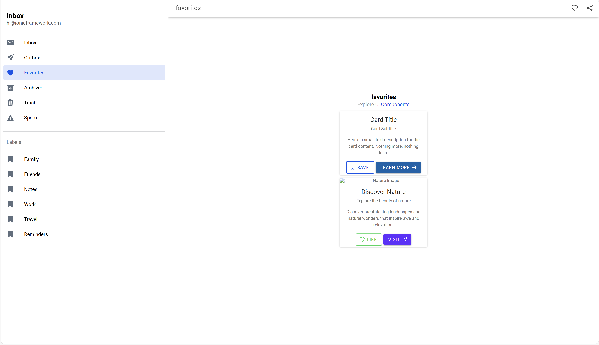

# Tugas Pertemuan 7 - Proyek Ionic

**Nama:** Muhammad Levi Asshidiqi  
**NIM:** H1D022103  
**Shift Baru:** A  

Panduan ini menjelaskan langkah-langkah untuk membuat komponen baru dalam proyek Ionic. Pertama, jika  belum memiliki proyek Ionic, buat proyek baru dengan perintah `ionic start myApp tabs`. Setelah itu, buat folder baru di dalam direktori `src/app` untuk menyimpan komponen . Misalnya, buat folder bernama `components`. Selanjutnya, di dalam folder `components`, buat file TypeScript baru untuk komponen , seperti `my-component.component.ts`.

Untuk mendefinisikan komponen, deklarasikan komponen  menggunakan `@Component` decorator dari Angular. Isi properti `selector`, `templateUrl`, dan `styleUrls` sesuai dengan kebutuhan. Sebagai contoh, kode TypeScript untuk komponen bisa terlihat seperti ini:

```typescript
import { Component, Input } from '@angular/core';

@Component({
  selector: 'app-my-component',
  templateUrl: './my-component.component.html',
  styleUrls: ['./my-component.component.scss']
})
export class MyComponentComponent {
  @Input() title: string;
}

Setelah mendefinisikan komponen, buat file HTML untuk menentukan tampilan komponen . dapat menggunakan sintaksis templating Angular di sini. Berikut adalah contoh template HTML untuk komponen 

<ion-card>
  <ion-card-header>
    <ion-card-title>{{ title }}</ion-card-title>
  </ion-card-header>
  <ion-card-content>
    <!-- Konten dapat ditambahkan di sini -->
  </ion-card-content>
</ion-card>


Selanjutnya, buat file SCSS untuk mendefinisikan gaya CSS komponen.

Setelah itu, perlu mengimpor komponen ke dalam app.module.ts dan menambahkannya ke dalam array declarations. Berikut adalah contoh bagaimana mengimpor dan mendeklarasikan komponen dalam module:

// app.module.ts
import { NgModule } from '@angular/core';
import { BrowserModule } from '@angular/platform-browser';
import { RouteReuseStrategy } from '@angular/router';
import { IonicModule, IonicRouteStrategy } from '@ionic/angular';

import { AppComponent } from './app.component';
import { AppRoutingModule } from './app-routing.module';
import { MyComponentComponent } from './components/my-component/my-component.component';

@NgModule({
  declarations: [AppComponent, MyComponentComponent],
  // ...
})
export class AppModule {}

file `TambahProduk`
## Screenshot

